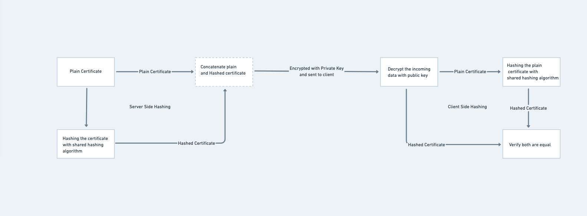

We will see about how TLS encryption works, what are different types of encryptions available in cypher suites. How forward secrecy is maintained using DH key exchange algorithm.

<!-- more -->

First look at different types of encryptions available.

* [Symmetric Encryption](#symmetric-encryption)
* [Asymmetric Encryption](#asymmetric-encryption)

#### Symmetric Encryption

In Symmetric Encryption we use single token to encrypt and decrypt the data across network. Both server and client uses the same token to encrypt and decrypt the data. Usally helpful to encypt bulk data.

#### Asymmetric Encryption

Unlike in symmetric key, we utilize two different keys to encryption and decryption. Data encrypted using one key(public key) can be only decrypted using another key(private key) and vice versa. However, you generate both the keys at server and will transfer public key to clients for encrypting their data.

### TLS Functionalities

TLS protocol follows four different functionalities or steps to achieve encrypted data transfer across the network from server to client.

* [Cipher Suites](#cipher-suites)
* [Key Exchange](#key-exchange)
* [Digital Signature](#digital-signature)
* [Bulk Data Encryption](#data-encryption)

#### Cipher Suites

Cipher suites are sets of algorithms and protocols required to secure communication between server and clients. As a first step client sends set of cipher suites which are supported to the server. Server verifies the set of cipher suites and picks one of the cipher suites available at server to make secure communication. These cipher suite holds information about different combinations of `key-exchange algorithms`, `Digital Signature Algorithms`, `Bulk Encryption Alogorithm` and `Hashing Algorithms` which are supported by client.

#### Key Exchange

To encrypt bulk data across client and server we use symmetric keys. The exchange algorithm used to exchange this cyptographic symmetric key are called key exchange algorithms. Most popular key exchange algorithms are 

* [RSA](#rsa)
* [Deffie Hellman](#deffie-hellman)

###### ***RSA***

RSA algorithm is used in both key exchange and digital signature validation. Usually RSA in key exchange functionalityu of TLS1.2 is used to encrypt `pre-master` key from client side and share it to server. At server side it decrypts using private key and now both client and server generates `master key` using psuedorandom function(PRF).

> master_secret = PRF(pre_master_secret, "master secret", ClientHello.random + ServerHello.random) [0..47];

###### ***Deffie Hellman***

Unlike RSA, we will not be using key pairs to encrypt and decrypt the cryptographic key which should be exchanged. 

**Client Side**
* Consider a prime number q = 17
* Primitive root of 17 is r = 3 

> primite root number is a number whose `(r) power (p) mod (q) < q` where `p<q` for example `3^^16%17=1<17`
{: .prompt-tip }

* Now we calculate private key(ck) and public key(cp). Pick any number as privatekey in between 0 and q. Let us consider here *`Privatekey(ck)`*=15
    * *`Publickey(cp)`* = (r) power (ck) mod (q) = (3)^^15 % 17 = 6

> Send *`Prime number(q)`*, *`Primitive root(r)`*, *`Publickey(cp)`* to the Server Side

**Server Side**
* Calculate private key(sk) and public key(sp). Pick any number as privatekey in between 0 and q. Let us consider here *`Privatekey(sp)`*=13
    * *`Publickey(sp)`* = (r) power (sk) mod (q) = (3)^^13 % 17 = 12

> Send *`Server Public Key(sp)`* to the client key

Now server and client calculate the secret to encrypt the bulk data using below equations.

* Server Side: (cp) power (sk) mod (q) = (6) ^^ (13) % (17) = 10
* Client Side: (sp) power (ck) mod (q) = (12) ^^ (15) % (17) = 10

#### Digital Signature

Main objective is to verify the data sent from the server to client is valid. It makes sure the documents and data are not tampered in middle. This is achieved using asymmetric encryption of certificate using private key from the server and sending it to client which verifies by decrypting it with public key. Below image depicts sample workflow of how the certificate signature is verified and validated using RSA Algorithm. You can also see use of `Hasing Algorithm` used to hash which is specified in the [cipher suite](#cipher-suites).

#### Data Encryption

A bulk cipher is a symmetric encryption algorithm that is used to encrypt and decrypt large amounts of data.

There are two types of bulk ciphers:
* Stream ciphers
* Block ciphers.

A stream cipher, which operates on data 1 byte at a time, converts a key to a keystream to encrypt data and produce ciphertext. The remote end converts the shared key to the same keystream and decrypts the plaintext data. RC4 (128 bit) is the most common stream cipher.

A block cipher operates on data in groups (or blocks) of bytes. Stream ciphers perform better than block ciphers. However, block ciphers provide better security. DES (56-bit), Triple-Data Encryption Standard (TDES) (168-bit), and Advanced Encryption Standard (AES) are the most common block ciphers. DES and TDES operate on blocks of 8 bytes at a time. AES operates on blocks of 16 bytes at a time.

Know more about [AES](https://www.trentonsystems.com/blog/aes-encryption-your-faqs-answered)

### Forward Secrecy

Additional Reference about TLS functionality is available [here][tls12_reference]

[tls12_reference]: https://www.acunetix.com/blog/articles/establishing-tls-ssl-connection-part-5/